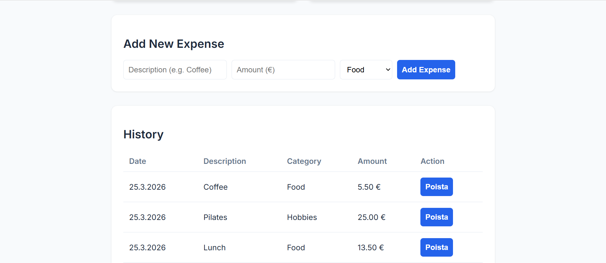
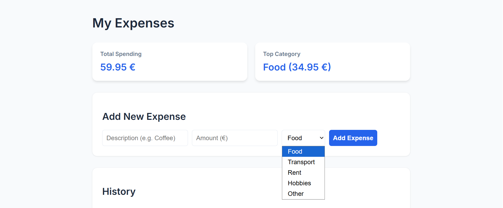

# 💰 Personal Expense Tracker (C# Full Stack)

**Tekijä:** Sofiya Sakhchinskaya

**Personal Expense Tracker** on C#-pohjainen Full Stack -sovellus, joka on suunniteltu omien menojen hallintaan ja analysointiin. Projekti keskittyy erityisesti tehokkaaseen datanhallintaan, SQL-kyselyiden optimointiin ja selkeään backend-arkkitehtuuriin.

### Huomioitavaa toiminnallisuudesta:
Sovelluksen toiminnallisuus jakautuu kahteen eri tasoon:
* **Tietokanta ja Backend:** Täysi tietokantatuki (SQLite) on toteutettu ja testattu toimivaksi **VSC-terminaalissa**. Tämä ratkaisu valittiin, koska projektin ytimenä oli demonstroida C#-kielen ja SQL:n tehokasta hyödyntämistä paikallisessa kehitysympäristössä.
* **Frontend ja Pilvijulkaisu:** Netlify-versiossa painotus on käyttöliittymän (UI/UX) ja visualisoinnin esittelyssä. Päätin jättää tietokantayhteyden toteuttamatta pilviympäristöön, sillä tässä vaiheessa projektia painopiste oli nimenomaan VSC-työskentelyssä ja backend-arkkitehtuurin hallinnassa – täyden pilvi-integraation lisääminen ei ollut projektin tavoitteiden kannalta tarkoituksenmukaista.

---

## 🔗 Linkit
- **Live Demo:** [[ Linkki Netlifyyn](https://ssofiyaspersonal.netlify.app/)]
- **GitHub:** [https://github.com/ssofiyas/personal-expense-tracker]

---

## 📖 Sisällysluettelo
- [💰 Personal Expense Tracker (C# Full Stack)](#-personal-expense-tracker-c-full-stack)
    - [Huomioitavaa toiminnallisuudesta:](#huomioitavaa-toiminnallisuudesta)
  - [🔗 Linkit](#-linkit)
  - [📖 Sisällysluettelo](#-sisällysluettelo)
  - [💡 Tietoja sovelluksesta](#-tietoja-sovelluksesta)
  - [⚙️ Tekninen ydin (C# \& Backend)](#️-tekninen-ydin-c--backend)
  - [✨ Toiminnot](#-toiminnot)
  - [🛠 Teknologiat](#-teknologiat)
  - [📸 Kuvakaappaukset](#-kuvakaappaukset)
  - [🚀 Asennus ja käyttö](#-asennus-ja-käyttö)

---

## 💡 Tietoja sovelluksesta
Tämä sovellus syntyi tarpeesta luoda työkalu, joka tarjoaa käyttäjälle välitöntä analyyttista tietoa talouden tilastan. Sovellus laskee dynaamisesti muun muassa suurimmat kuluerät ja menojen prosentuaalisen jakautumisen.

## ⚙️ Tekninen ydin (C# & Backend)
Projektin painopiste on vahvasti **C#-kehityksessä** ja **tietokantaintegraatiossa**:

* **Dapper ORM:** Käytetty kevyenä ja nopeana rajapintana C#-koodin ja SQLiten välillä. Dapper mahdollisti tyyppiturvalliset kyselyt säilyttäen natiivin SQL:n suorituskyvyn.
* **Data Aggregation:** Hyödynnetty SQL:n `GROUP BY` ja `SUM` -funktioita suoraan backendissä, jotta laskentateho pidetään tietokantatasolla.
* **Input Validation:** C#-logiikka käsittelee syötteet (kuten valuuttamuunnokset pilkusta pisteeseen) varmistaen datan eheyden ennen tallennusta.
* **SQLite-integraatio:** Automaattinen tietokannan alustus ja skeeman hallinta ohjelman käynnistyessä.

## ✨ Toiminnot
- **Täysi CRUD-logiikka:** Menojen lisäys, haku ja poisto uniikin ID:n perusteella.
- **Top Category -analyysi:** Laskee reaaliajassa backend-logiikalla, mikä kategoria kuluttaa eniten budjettia.
- **Prosentuaalinen raportointi:** Laskee kunkin kategorian suhteellisen osuuden kokonaiskuluista.
- **Moderni UI:** Responsiivinen JavaScript-käyttöliittymä, joka viestii saumattomasti backendin kanssa.

## 🛠 Teknologiat
- **Kieli:** C# (.NET 8)
- **Tietokanta:** SQLite
- **Kirjastot:** Dapper (Micro-ORM), Microsoft.Data.Sqlite
- **Front-end:** HTML5, CSS3 (Modern Grid/Flexbox), Vanilla JavaScript

## 📸 Kuvakaappaukset

![Expense Tracker UI]




## 🚀 Asennus ja käyttö
1. Kloonaa tämä repositorio.
2. Varmista, että sinulla on `.NET 8 SDK` asennettuna.
3. Suorita terminaalissa projektin juuressa:
   ```bash
   dotnet build
   dotnet run